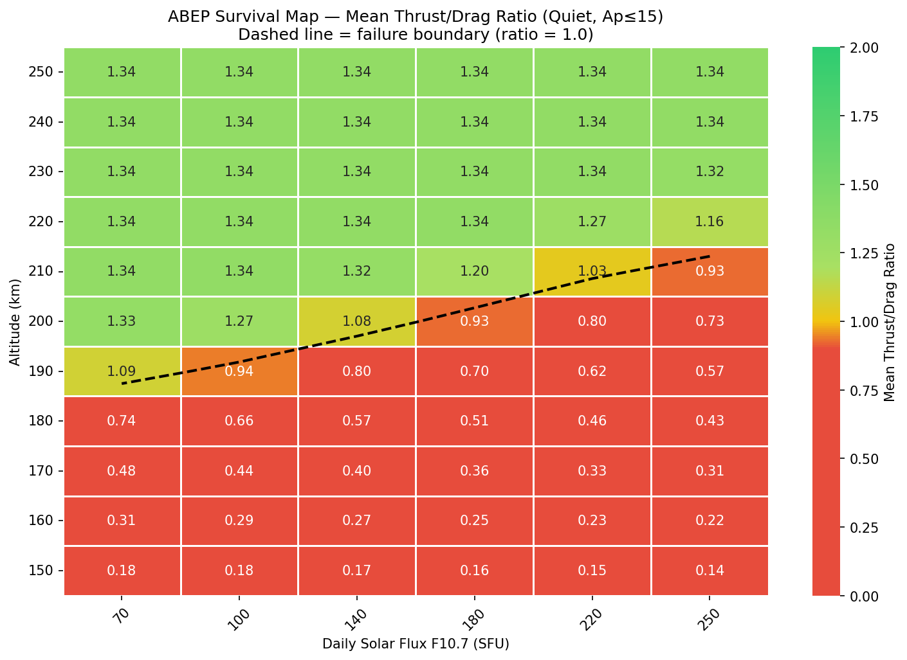
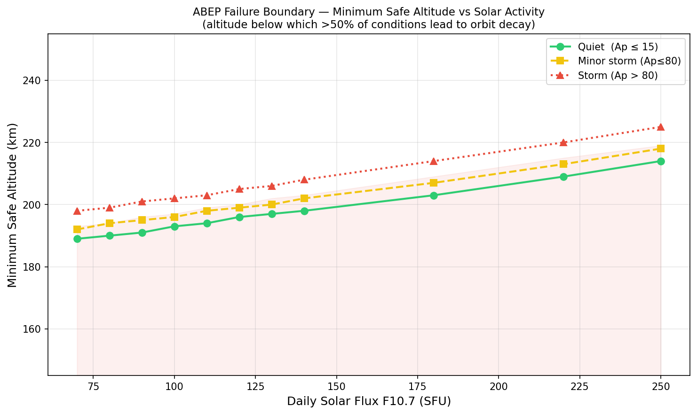
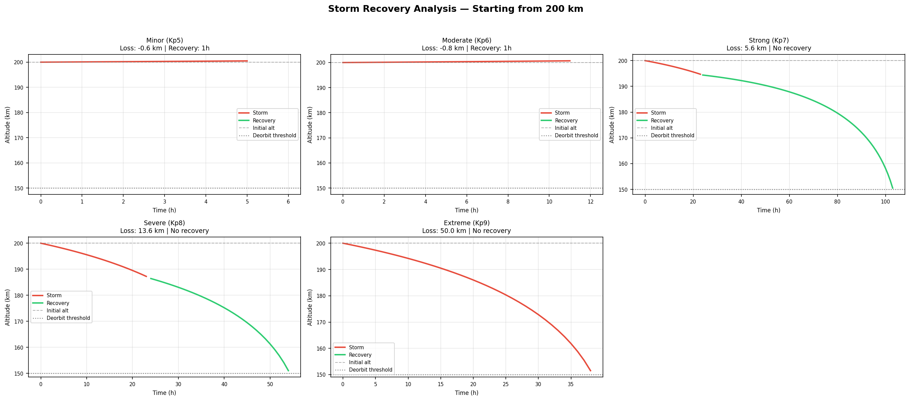

# ABEP Mission Planner — VLEO Satellite Failure Boundary Analysis

A ground-based Python tool that determines whether an Air-Breathing Electric Propulsion (ABEP) satellite can survive at a given Very Low Earth Orbit (VLEO) altitude for a specified mission duration, and maps the exact failure boundaries across all realistic atmospheric conditions. Built for [Orbitt Space](https://orbitt.space) (Ahmedabad, India), the planner runs up to 196,000 atmospheric model calls per analysis, applies rule-based analysis to identify drag-failure boundaries, refines the search grid around those boundaries, and escalates to Claude (Anthropic) when multi-variable interactions exceed what heuristics can explain — producing a full mission feasibility report with heatmaps, boundary maps, and storm recovery timelines.

---

## Key Findings (200 km baseline mission, 365 days)

### Failure boundary is non-monotonic

The ABEP system does not fail in a simple "higher solar flux = worse" pattern. At 195 km, failure rate jumps from **0% at F10.7 = 70** to **79% at F10.7 = 140** — before the atmosphere even reaches solar maximum density. The physical driver: moderate solar heating shifts atmospheric composition toward lighter molecules, reducing propellant mass flow before drag increases enough to compensate. This non-monotonic region sits between **194–213 km** and is the primary risk zone.

> Critical altitude (50% failure rate crossover): **201 km**  
> Failure boundary shifts **20 km higher** between solar minimum and solar maximum.

### Storm behaviour is altitude-dependent

At **210 km**, the spacecraft survives Kp7 (strong) storms with only −1.0 km altitude loss and recovers within 1 hour. At **200 km**, the same Kp7 storm causes −5.6 km loss with **no recovery** — the satellite enters a deorbit spiral. Extreme events (Kp9, 48 h) produce −50 km loss at 200 km.

| Storm | Ap | Duration | Alt loss @ 200 km | Alt loss @ 210 km | Survives @ 210 km |
|---|---|---|---|---|---|
| Minor (Kp5) | 50 | 6 h | −0.6 km | −1.0 km | Yes |
| Moderate (Kp6) | 100 | 12 h | −0.8 km | −2.1 km | Yes |
| Strong (Kp7) | 150 | 24 h | −5.6 km ⚠️ | −1.0 km | Yes |
| Severe (Kp8) | 200 | 24 h | −13.6 km ⚠️ | −4.7 km | No |
| Extreme (Kp9) | 300 | 48 h | −50.0 km ⚠️ | −23.2 km | No |

### 205–220 km is the viable operating band

With default spacecraft parameters, no safe (ratio > 1.5) operating points exist at 200 km. Raising altitude to **220 km** combined with modest engineering improvements brings failure rates into an operationally manageable range. Claude's analysis of the boundary data identified three changes — in priority order — that would shift the viable floor down by 5–10 km:

1. **+40–50% inlet collection efficiency** (highest impact)
2. **+25–30% specific impulse** (currently 5000 s)
3. **−20% drag coefficient** via aerodynamic shaping

Seasonal risk windows: equinox months (March–April, September–October) at solar maximum show 51–53% failure rates. Winter months (December–February) are best at 40–45%.

---

## Screenshots

### Survival Heatmap — Thrust/Drag Ratio (Altitude × Solar Flux)


### Failure Boundary Map


### Storm Recovery Timeline


---

## Architecture

The planner runs a 6-phase autonomous agent pipeline:

```
User inputs (altitude, duration, spacecraft params)
        │
        ▼
┌─────────────────────────────────────────┐
│  Phase 1: COARSE SWEEP                  │
│  11 altitudes × 12 months × 6 F10.7    │
│  levels × 6 Ap levels × 3 latitudes    │
│  = 14,256 NRLMSISE-00 calls            │
└─────────────────────────────────────────┘
        │
        ▼
┌─────────────────────────────────────────┐
│  Phase 2: RULE-BASED ANALYSIS           │
│  Failure rate by altitude / F10.7 / Ap │
│  Interaction effects, seasonal patterns │
│  Boundary zone detection                │
└─────────────────────────────────────────┘
        │
        ├── boundary found?
        ▼
┌─────────────────────────────────────────┐
│  Phase 3: GRID REFINEMENT               │
│  1 km altitude steps in boundary zone  │
│  Finer F10.7 and Ap steps              │
│  5,000–15,000 additional runs          │
└─────────────────────────────────────────┘
        │
        ├── non-monotonic / unexplained clusters?
        ▼
┌─────────────────────────────────────────┐
│  Phase 4: CLAUDE API ESCALATION         │
│  Boundary-zone data → claude-sonnet     │
│  Atmospheric physicist system prompt    │
│  1–3 API calls per full run             │
└─────────────────────────────────────────┘
        │
        ▼
┌─────────────────────────────────────────┐
│  Phase 5: STORM RECOVERY ANALYSIS       │
│  Altitude loss per storm severity       │
│  Recovery time estimation               │
└─────────────────────────────────────────┘
        │
        ▼
┌─────────────────────────────────────────┐
│  Phase 6: REPORT GENERATION             │
│  mission_report.md + 3 PNG charts       │
│  sweep_results.csv (raw data)           │
└─────────────────────────────────────────┘
```

### Physics at each grid point

```
Orbital velocity    v   = √(GM / (R_earth + h))
Drag force          F_d = ½ ρ v² Cd A_frontal
Collected propellant ṁ  = ρ v A_intake η_intake
Available power     P   = A_panel × 1361 W/m² × η_panel × (1 − f_eclipse) − P_housekeeping
Power-limited thrust    = P × (T/P ratio)
Propellant-limited thrust = ṁ × Isp × g₀ × η_ionization
Effective thrust    F_t = min(power-limited, propellant-limited)

Thrust/drag ratio classification:
  > 1.5   → SAFE
  1.2–1.5 → ADEQUATE
  1.0–1.2 → MARGINAL
  < 1.0   → FAILURE
```

---

## Tech Stack

| Component | Technology |
|---|---|
| Atmospheric model | [NRLMSISE-00](https://pypi.org/project/nrlmsise00/) — empirical model of Earth's upper atmosphere |
| Physics engine | NumPy — thrust/drag balance, orbital mechanics |
| Data handling | pandas — sweep results, analysis DataFrames |
| Visualisation | matplotlib + seaborn — heatmaps, boundary maps, storm charts |
| AI reasoning layer | [Anthropic Claude API](https://docs.anthropic.com) (`claude-sonnet-4-6`) — boundary pattern interpretation |
| Dashboard | React (`ABEPDashboard.jsx`) — interactive timeline and heatmap viewer |
| CLI | argparse |
| Config | python-dotenv |

---

## Installation

```bash
# 1. Clone the repository
git clone <repo-url>
cd orbitt-space

# 2. Create and activate a virtual environment
python3 -m venv .venv
source .venv/bin/activate        # macOS / Linux
# .venv\Scripts\activate.bat     # Windows

# 3. Install dependencies
pip install -r abep-mission-planner/requirements.txt

# 4. Set your Anthropic API key
cp abep-mission-planner/.env.example abep-mission-planner/.env
# Edit .env and add:  ANTHROPIC_API_KEY=sk-ant-...

# 5. Run a quick sanity check
cd abep-mission-planner
python main.py --altitude 200 --quick --no-claude
```

---

## CLI Usage

All commands are run from `abep-mission-planner/`.

### Parameter sweep mode (default)

```bash
# Full sweep at default 200 km, 1-year mission
python main.py

# Different target altitude
python main.py --altitude 220

# Two-year mission at 210 km
python main.py --altitude 210 --days 730

# Fast mode — skip grid refinement (Phase 3)
python main.py --altitude 200 --quick

# Skip Claude API call (offline / no key)
python main.py --altitude 200 --no-claude

# Tune spacecraft parameters
python main.py --altitude 205 --isp 6500 --panels 6.0 --intake 1.4

# Custom output directory
python main.py --altitude 215 --output outputs/mission_215km
```

### Timeline mode — propagate through real solar conditions

```bash
# 5-year timeline from 2027, default altitude
python main.py --timeline --timeline-start 2027-01-01 --timeline-days 1825

# 3-year timeline at 210 km starting mid-2025
python main.py --timeline --altitude 210 --timeline-start 2025-06-01 --timeline-days 1095

# Pure SC25 sinusoidal model (no network fetch required)
python main.py --timeline --timeline-use-model

# Finer time resolution (30-minute steps)
python main.py --timeline --timeline-dt 0.5
```

### All flags

| Flag | Default | Description |
|---|---|---|
| `--altitude` | 200 | Target orbit altitude (km), range 150–250 |
| `--days` | 365 | Mission duration (days) |
| `--lat` | 0 | Analysis latitude (deg); 0 = equatorial |
| `--output` | `outputs` | Output directory |
| `--mass` | 200 | Spacecraft mass (kg) |
| `--frontal` | 1.2 | Frontal area (m²) |
| `--intake` | 1.0 | Intake collection area (m²) |
| `--eta-intake` | 0.40 | Intake efficiency (0–1) |
| `--isp` | 5000 | Thruster specific impulse (s) |
| `--tp-ratio` | 25 | Thrust-to-power ratio (mN/kW) |
| `--panels` | 4.0 | Solar panel area (m²) |
| `--panel-eff` | 0.30 | Solar panel efficiency (0–1) |
| `--quick` | off | Skip grid refinement |
| `--no-claude` | off | Skip Claude API escalation |
| `--no-report` | off | Skip report and chart generation |
| `--timeline` | off | Run timeline mode instead of sweep |
| `--timeline-start` | 2027-01-01 | Timeline start date (YYYY-MM-DD) |
| `--timeline-days` | 1825 | Days to propagate in timeline mode |
| `--timeline-dt` | 1.0 | Time step in hours for orbit propagation |
| `--timeline-use-model` | off | Force SC25 model; skip NOAA network fetch |

---

## Output Files

Each run writes to `--output` (default: `outputs/`):

| File | Description |
|---|---|
| `mission_report.md` | Full feasibility report — verdict, boundary analysis, storm table, AI findings, design feedback |
| `survival_heatmap.png` | Thrust/drag ratio heatmap: altitude (y) × F10.7 (x), colored SAFE→FAILURE |
| `boundary_map.png` | Failure boundary line across altitude × solar flux with seasonal bands |
| `storm_recovery.png` | Altitude loss and recovery timelines for each storm severity |
| `sweep_results.csv` | Raw data from all model runs (up to 196,020 rows) |
| `timeline_data.json` | *(timeline mode only)* Hour-by-hour orbital state for dashboard |

---

## Default Spacecraft Parameters

```python
mass_kg                  = 200       # Satellite mass
frontal_area_m2          = 1.2       # Cross-section facing ram direction
drag_coefficient         = 2.2       # Free molecular flow (standard)
intake_area_m2           = 1.0       # Gas collection area
intake_efficiency        = 0.40      # Fraction of incoming particles captured
specific_impulse_s       = 5000      # RF ion thruster Isp
thrust_to_power_mN_per_kW= 25        # Thruster performance
solar_panel_area_m2      = 4.0       # Total panel area
solar_panel_efficiency   = 0.30      # Panel conversion efficiency
eclipse_fraction         = 0.35      # Fraction of orbit in shadow
housekeeping_power_W     = 50        # Avionics + comms baseline
ionization_efficiency    = 0.70      # Gas ionization fraction
battery_capacity_wh      = 500       # Onboard storage
```

Override any parameter via CLI flags (e.g. `--isp 6500 --panels 6.0`).

---

## License

MIT License — see [LICENSE](LICENSE) for details.

> **Note:** This is Phase 1 — ground-based analysis only. All atmospheric data comes from the NRLMSISE-00 empirical model, not live telemetry. Spacecraft parameters are adjustable defaults based on published ABEP literature and do not represent Orbitt Space's proprietary design values.
